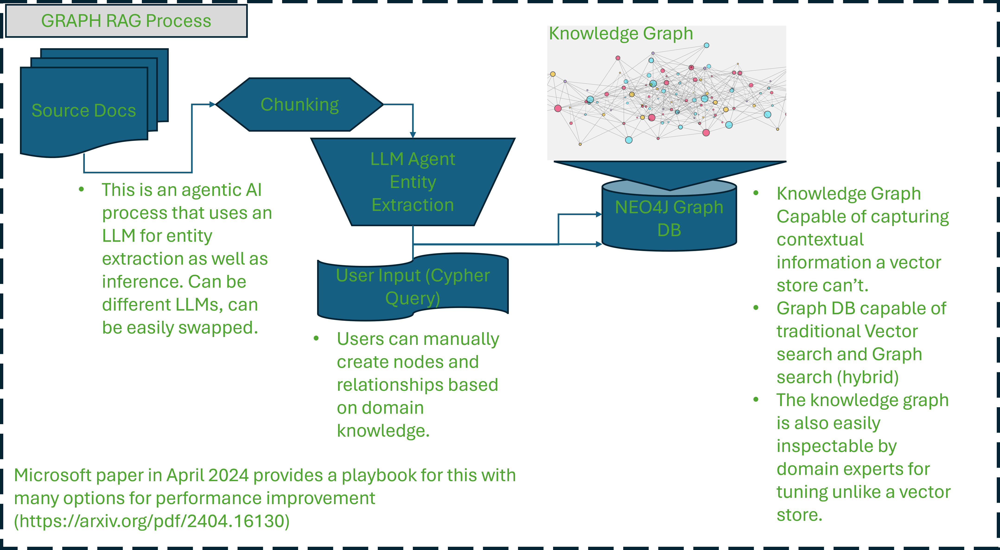

# Video Link: https://www.youtube.com/watch?v=2hDxoD4PXsU

# Graph RAG: Powerful, Explainable, Augmentation

### John Coogan

## Introduction

Large Language Models (LLMs) are an impressive development for modern technology. While seemingly magically capable of generating human-like text, they also represent some of the most difficult tools to understand. This facet of LLMs leaves room for myriad 'black box' issues such as bias, poor interpretability, adversarial attacks, and more. Ultimately, when you utlize an LLM, you often accept a level of non-determinism and opacity in your results. While there are many use cases where this is acceptable, there are many more where it is not. Beyond the more nefarious issues presented above, there are also many readily apparent, logistical, issues such as the scope and timeliness of the training data. At the end of the day, an LLM only 'knows' what it has been trained on and, while it can still generate text to answer any question (because the generation of text comes down to the question of what the next most probable word is), the quality of the answer is directly related to the quality of the training data. What we are left with is a tool that is incredibly powerful but, in domain specific applications, can be incredibly brittle. 

This project is an exploration of the use of graphs, vector stores, and retrieval augmented generation to not only improve the performance of certain models but to also simultaneously address many of these shortfalls.

## RAG and Graphs

Retrieval Augmented Generation or RAG is not a new concept. Traditionally, this method works by embedding a query and a context into a shared vector space. The query is then used to retrieve a set of relevant documents from the context. These documents are then provided to an LLM along with they original query at inference to provide up to date 'knowledge' to the model. This is an extremely powerful concept as it allows a model to have access to a constantly up to date set of information or highly domain specified information. 

This process exploits the ability to convert tokens or groups of tokens into single vectors in semantic space:

We can then take queries, convert them to vectors, and find documents (or chunks of documents) within the context semantic space that are most similar to the query vector. You could imagine the figure above being entire portions of documents instead of just words. The core concept here is that documents that are most similar semantically to a query are most likely to have additional information that is relevant to the query.

The drawbacks to this method are numerous. First, information is invariably lost when converting a document to a single vector and so the semantic space that the text is projected into may or may not accurately capture the true meaning of the word. This comes down to the training data that was used to create the embedder (the neural network which converts texts to vectors). This project utilizes the all-MiniLM-L6-v2 from the sentence-transformers library which is the default for Neo4j's graph builder. How well the training data used to create this embedder aligns to the domain you wish to use it on can have drastic impacts on the performance of your model. In this instance we use the default for ease of use but acknowledge that a more domain specific embedder would likely improve performance. Second, if an idea or valuable contextual information spans multiple chunks, vector RAG may not be able to pick up on it. Relationships between ideas or entities can be very difficult to capture with a vector store of document chunks. This is where graph RAG comes in.

The basic idea is that a separate LLM (again, preferrably domain specified) is used to parse source documentation for entities and relationships. Unlike asking an LLM regular questions, which can invite hallucination, bias, and other issues, the LLM is asked to read chunks of text and identify entities and relationships between entities. This is a highly specific, closed problem. It doesnt mean that the LLM can't get it wrong, but it reduces the risk exposure to the aforementioned issues. This process can be dramatically improved with prompt engineering, few-shot examples, and other techniques. The temperature of the extracting LLM can also be set to 0 to remove non-determinism in the extraction process. A graph transformer (via Neo4j, DiffBot, or Langchain) can then be used to convert these entities and relationships into cypher query which loads them into a knowledge graph.

A diagram and source paper are shown below:

There are many benefits to this process. First, entity extraction is a one-time cost, meaning that it doesnt have to happen every time you execute the retrieval chain so you can 'go big' on the agent model. In this example we utilized GPT 4.0 because we wanted to extracted entities and relationships to be rich and accurate. Second, once you load the database, you can visually inspect it and make changes on the fly with cypher query! Neo4j comes out of the box with an outstanding GUI. Whether hosted via AuraDB (which we use in this example) or ran locally with the desktop version and localhost, you can inspect and interact with your knowledge graph in real time:

Indeed the image aboce not only shows the knowledge graph we build from five medical papers on Sepsis Research with over 900 nodes and over 5000 relationships, but also shows a cool bit of cypher querying the database. You may have noticed the image at the beginning of the readme:

### 5 Medical Paper Knowledge Graph on Sepsis Research

This is what the final knowledge graph looks like once completed. The different colors represent entities, chunks, and source files with options to further specify colors for visualization. 

I want to pause here quickly to appreciate where we are. First, we have broken the entirety of our source documentation into connected nodes and relationships which can be easily (and computationally efficiently) queried. Second, we have narrowly scoped the tasks of our LLMs to entity extraction and relationship extraction, the performance of which can be easily measured and improved. Now, how does this get us to a better RAG model?

## LangChain Aside

If ever you are to search implementation of this powerful technique, you are inevitably going to encounter LangChain. I am confident that this library is improving and there are many that may disagree but I found that the library was a needlessly complex wrapper of Neo4j and cypher. It abstracted too much away from the user and, in so doing, removed a lot of user control. This may improve but you will see in the repository notebook that all the helper functions are implemented from scratch. I think this will be much easier to follow and allow for iteration and improvement. 

## Graph RAG

The final step is to use the knowledge graph to augment the retrieval process. The [Microsoft Paper](https://arxiv.org/pdf/2404.16130) on Graph RAG covers a lot of advanced techniques including community detection algorithms and prompt engineering. This implementation goes simple (relatively) to better understand the base benefits of the methodology. Our graph chain works by extracting entities from a user input (this can be with any model, we use LLama3.2 locally to highlight the lightweight flexebility of this system), associate those entities with nodes in the knowledge graph, and then do a community search around those nodes to get all the related information. This information is then fed to the LLM along with the original query. We make the design choice of including all nodes within 2 hops of each query entity. This is a simple design choice that can be easily modified to include more or less information but keeps the context small enough to be easily digestible by the LLM. 

The graph generated context, in this project, looks something like this:

> Albumin GROUP_HAS_LOWER Platelet Count, 

> Albumin HAS_PROPERTY scavenger of reactive oxygen and nitrogen species,

> Albumin HAS_PROPERTY carrier for several endogenous and exogenous compounds,

> sepsis ASSOCIATED_WITH long-term cognitive decline,

> sepsis HAS_MANAGEMENT_PRINCIPLE control of the source of infection, 

Which aligns to the format:

**(Node: Entity) -> [RELATIONSHIP] -> (Node: Entity)** 

And is effectively the base format pattern for cypher query. That is because each line above represents a node traversal in the 2-hop community search around a single entity. By probiding this information to the LLM at inference can give much more specific information to the model than a simple vector store because we can find relationships between any ideas within a document by traversing 2 hops in the graph.

But there is more, as infrequently the case in life we dont have to settle for one methodology or the other. Neo4j supports hybrid vector and graph search which allows us to provide the results of Graph RAG and Vector RAG to a model at inference. Indeed you will see a hybrid RAG model implemented in the repository notebook with an option to generate from either the graph or the vector store (or both!). 

## So What?

Lets recap. We have a system that can extract entities and relationships from source documentation, load them into a knowledge graph, and then use that knowledge graph to augment the retrieval process of an LLM. This system is highly specific, easily iterated upon, and can be easily inspected and modified by the user. This system is also highly explainable. The user can see exactly what information is being fed to the LLM at inference and can easily modify the system to include more or less information. While our vector RAG implementation cites the text and the article which it retrieved, the graph RAG implementation can show you the exact community which was pulled in to the model's context (both via text and via the Neo4j GUI):

Above we see what a 2 hop community for the entity "Platelet Count" looks like. This is an immensely powerful tool because it provides rich, domain specific context to a model at inference time but it is also a highly explainable and controllable tool. Every LLM in this process can have its temperature set to 0 and simply act as a text aggregator. The context provided to the model, coupled with the prompt, is so comprehensive that the LLM needs to simply regurgitate the information in a coherent manner which removes a significant ammount of the risk where an LLM halucinates, allows bias to influence its output, or is adversarially attacked.

## Examples

As you can see in the notebook, we can ask the model a variety of questions. It turns out (much to our surprise) that each model we tested (llama 3.2 and granite3) both have a surprising base knowledge of Sepsis. This is likely because Sepsis is a condition almost as old as medicine itself and so the models were bound to have picked up some text about it in their training data. However, we were able to find some fault points. Specifically, the accronym for Early goal-directed therapy (EGDT) was easily picked up by our hybrid, vector, and graph approaches but our base models not only failed to correctly identify it but actually hallucinated convincing but incorrect results!

> Q: "What is EGDT?"

> A [llama3.2 hybrid]: 

**EGDT stands for Early Goal-Directed Therapy. It is a treatment protocol that involves administering intravenous fluids and vasoactive drugs to patients with severe sepsis, as well as antimicrobial therapy, in an effort to improve their chances of survival.**

**The name "Early Goal-Directed Therapy" refers to the idea that early intervention can help guide the treatment plan to achieve specific "goals," such as restoring adequate blood flow and oxygenation, and correcting any underlying imbalances.**

**However, according to the provided context, EGDT does not appear to have a significant impact on reducing mortality rates in patients with early septic shock. The ARISE study found no reduction in 90-day all-cause mortality among patients treated with EGDT compared to those receiving usual care.**

**In fact, some of the context highlights concerns and controversies surrounding the use of EGDT, such as potential risks associated with individual elements of the protocol, uncertainty about external validity, and infrastructure and resource requirements. Additionally, a separate study (PROCESS) found that protocol-based resuscitation (which includes EGDT) did not provide a survival benefit compared to usual care.**

**Overall, while EGDT was initially shown to be beneficial in some studies, more recent research has cast doubt on its effectiveness as a treatment for early septic shock.**

> A [llama3.2 vector]:

**Based on the provided context, EGDT stands for Early Goal-Directed Therapy. It is a protocol of hemodynamic resuscitation that was initially shown to improve outcomes in patients presenting to the emergency department with severe sepsis in a 2001 proof-of-concept trial. However, subsequent trials and studies have raised concerns about its effectiveness and potential risks, leading to controversy surrounding its role in treating patients with severe sepsis.**

> A [llama3.2 graph]:

**EGDT stands for Early Goal-Directed Therapy. It is a treatment protocol that was developed to improve outcomes in patients with sepsis, a life-threatening condition caused by an infection. The goal of EGDt is to quickly and aggressively treat patients with sepsis, using a combination of antibiotics, fluid resuscitation, and vasopressors (medications that constrict blood vessels) to stabilize their vital signs and improve oxygen delivery to organs.**

**The EGDt protocol was widely adopted in the early 2000s, but it has been the subject of much controversy and debate in recent years. While some studies suggested that EGDt could reduce mortality rates in patients with sepsis, more recent research has failed to replicate these findings, suggesting that EGDt may not provide a survival benefit for all patients.**

**In fact, several large trials have shown that EGDt does not reduce 90-day all-cause mortality in patients with early septic shock. Additionally, some studies have found no significant differences in 28-day or in-hospital mortality, length of hospital stay, or duration of organ support between the EGDt group and usual care.**

**The controversy surrounding EGDt centers around its high adherence to algorithm-directed therapies, but also concerns about potential risks associated with individual elements of the treatment protocol. Some critics have argued that the aggressive use of vasopressors in particular may increase mortality rates or cause unnecessary harm.**

**Despite these controversies, some studies have suggested that bundle-based care, which includes EGDt as part of a broader package of evidence-based treatments, may be more effective than usual care in reducing mortality rates and improving outcomes for patients with sepsis. As such, the Surviving Sepsis Campaign guidelines now recommend incorporating elements of the 6-hour resuscitation bundle into sepsis treatment protocols.**

**Overall, while EGDt was once hailed as a breakthrough treatment for sepsis, more recent research has raised important questions about its benefits and risks, and its place in modern sepsis treatment protocols.**

> A [LLama3.2 base]:

**I can suggest a few possibilities:**

 * **EGDt could refer to Endoscopic Gastric Drainage Treatment, which is a treatment approach for certain types of gastritis or gastric ulcers.**
* **EGDt might stand for Endoscopic Gastrointestinal Disease Treatment, which encompasses various treatments for gastrointestinal disorders.**

**If you provide more context or clarify what "EGDT" means in your question, I'll be happy to give a more specific and accurate answer.**

> A [Granite3 hybrid]:

**EGDT, or Early Goal-Directed Therapy, is a medical intervention used in the treatment of severe sepsis. It involves a specific protocol for hemodynamic resuscitation in patients presenting to the emergency department with early septic shock. The ARISE study aimed to test the hypothesis that EGDT would decrease 90-day all-cause mortality in these patients compared to usual care. However, the study found that EGDT did not reduce all-cause mortality at 90 days. Despite some nonrandomized studies showing survival benefits with bundle-based care that included EGDT, there is considerable controversy surrounding the role of EGDT in treating patients with severe sepsis due to concerns about potential risks, external validity, and infrastructure requirements.**

> A [Granite3 base]:

**EGDT, or Emergency General Surgery Department, is a department in a hospital that specializes in treating emergency surgical cases. It is designed to handle urgent and critical surgical situations that require immediate attention. The department typically operates 24/7 and has the necessary resources and equipment to perform a wide range of surgical procedures.**

## Conclusion

These are fascinating results. Not only does hybrid retrieval allow a model as small as 2b parameters to provide accuate, highly specialized output but it prevents such a model from providing convincing but incorrect answers. This method has a two fold effect, by heavily restricting what we need an LLM to do, we transfer the burden of knowledge from opaque weights and training data to a highly explainable and controllable knowledge graph. More importantly, unlike a vector store which will perpetually be limited by the quality of the embedding, a knowledge graph can be iterated on and improved by the user after easy inspection. This keeps LLMs in a small box while providing them with a wealth of curated information for inference. This methodology should be standard accross high risk or technically specific domains and I am excited to see where it goes next.  
